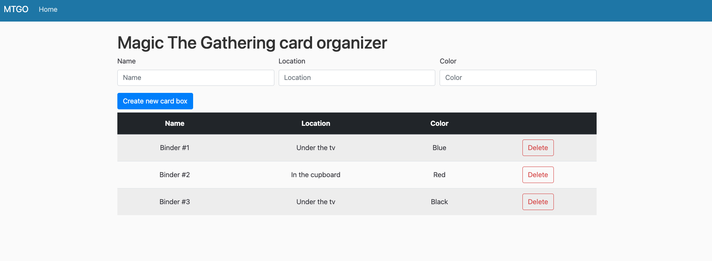
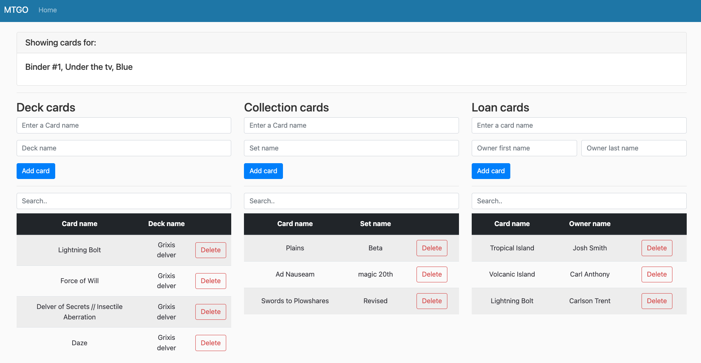
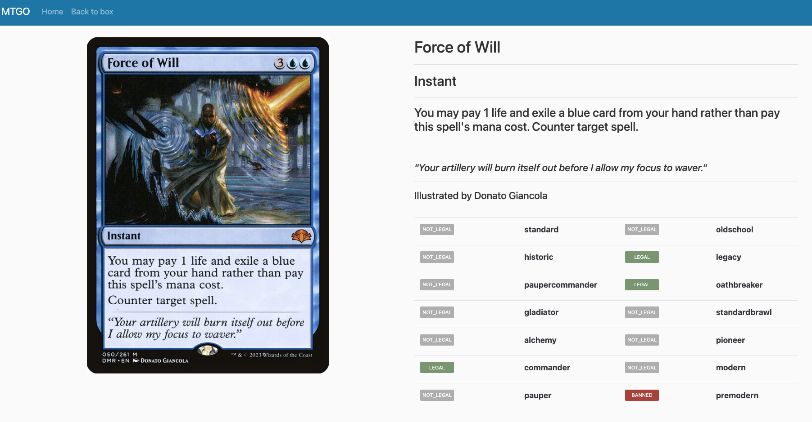

# Magic the Gathering card organizer

## Description

**Magic the Gathering card organizer** is a tool for managing your collection, decks of magic cards. 
It provides an intuitive user interface and a range of features for efficiently organizing and tracking your resources.

## Features

- **Collection Management**: Easily add, edit, and remove items from your collection.
- **Search and Sorting**: Quickly find items of interest with search and sorting features.
- **Integration with External APIs**: Using [ScryFall API](https://scryfall.com/docs/api) for auto completion of card names and showing card details.

## Installation

### Prerequisties
[`Docker with docker-compose`](https://docs.docker.com/get-docker/)

### Build and run
To run **Magic the Gathering card organizer**, follow these steps:
1. Clone this repository to your local machine.
2. Simply run the application using docker and docker-compose
3. The app will be available under the adress http://localhost:1500
   
Or just run:
```
$ cd <chosen directory>
$ git clone https://github.com/MaciejFranikowski/MagicTheGatheringCardOrganizer.git
$ cd MagicTheGatheringCardOrganizer
$ sudo docker-compose up -d
```

## Usage

Once the application is running, you can start managing your collection and decks through the user-friendly interface. Use the search and sorting features to quickly locate items, and enjoy the seamless integration with external API for enhanced functionality.

## License

This project is licensed under the [Apache 2.0 license](https://github.com/MaciejFranikowski/MagicTheGatheringCardOrganizer/tree/main?tab=Apache-2.0-1-ov-file#readme).

## Preview






